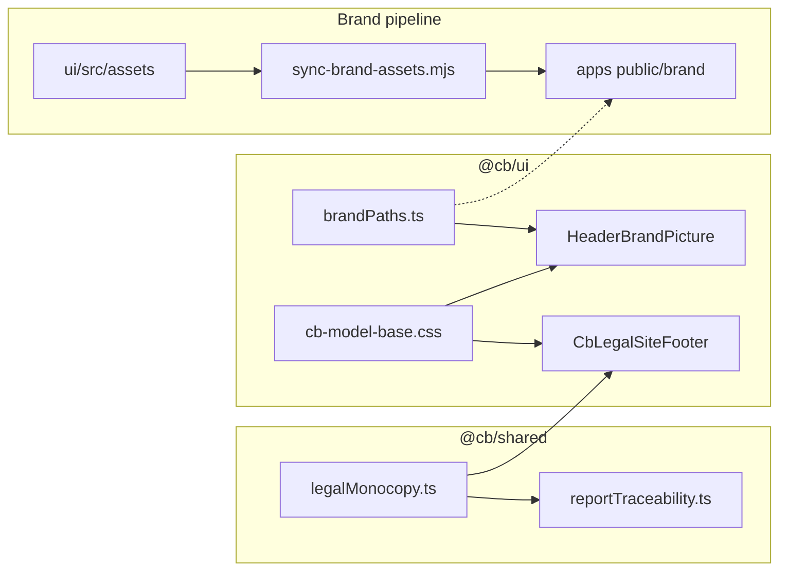

# Cursor handover

**Generated:** 2026-03-28  
**Updated:** 2026-04-01 (brand shell, legal footer, header `<picture>`, handover expansion)  
**Purpose:** Start a new chat from this file to avoid long, laggy threads. Paste or @-mention this file when opening a new session.

---

## Snapshot: where `main` should be (this session)

Recent `origin/main` / local `main` included at least these **brand and shell** commits (newest first):

| Commit | Summary |
|--------|---------|
| `4823edc` | style(ui): polish premium footer rhythm and desktop logo ladder |
| `88bf5b1` | feat(brand): dynamic header logo hierarchy + wider legal footer gutters |
| `74cd2e4` | feat(brand): switch wide header lockup to BiggerFont asset |
| `afcc997` | fix(ui): constrain legal footer width; lion-only header below 1280px |
| `085a38a` | feat(brand): Large-Full gold lockup + responsive header picture |
| `4d4ca13` | fix(ui): reliable header logos via `HeaderBrandPicture` |
| `3d1c671` | fix(ui): restore header logos + gold gradient legal rule |
| `0e99bca` | fix(ui): header logo scale, responsive wordmark/lion, visible legal footer |

Earlier product work still on history:

| Commit | Summary |
|--------|---------|
| `69b2529` | Capital Stress: **Monte Carlo path count** in CAPITAL DIAGNOSIS intro (`simulationCount`, gold bold serif). |
| `9d248c2` | Capital Stress: second **EXPAND ALL / COLLAPSE ALL** above **Structural Stability Map** (`toggleExpandAllSections` shared with lower control). |

**Verify current tip:**

```bash
git fetch origin && git log -1 --oneline origin/main
```

**Local working tree (as of last check):** there may be **uncommitted** edits under `apps/login/tailwind.config.ts`, `packages/ui/src/ModelAppHeader.module.css`, `packages/ui/src/index.ts`, plus **untracked** preview PNGs (`.preview-*.png`) and extra assets under `packages/ui/src/assets/` (e.g. alternate logos, `lionhead_Gold_no_tm.*`). Confirm with `git status` before assuming a clean tree.

---

## Locked restore point (older — optional)

| | |
|---|---|
| **Tag** | `restore-point-2026-03-28` |
| **Commit** | `eee0b61` — *fix(ui): center ChromeSpinnerGlyph and restore reliable rotation* |

Return with `git checkout restore-point-2026-03-28` or `git checkout eee0b61` if you need the **pre-stress-copy** spinner/layout baseline. For latest product work, use **`origin/main`** instead.

---

## Context and background

### Monorepo

- **Workspace:** `capitalbridge-suite` — apps: `capitalstress`, `capitalhealth`, `incomeengineering`, `forever`, `login`, `platform`, `api`.
- **Shared packages:** `@cb/ui`, `@cb/shared`, `@cb/advisory-graph`, `@cb/lion-verdict`, `@cb/pdf`.
- **Login / pricing (public):** [login.thecapitalbridge.com/pricing](https://login.thecapitalbridge.com/pricing) — SELECT PLANS, auth chrome.
- **Capital Stress (prod example):** `capitalstress.thecapitalbridge.com` — dashboard after login.

### Prior arc (before this conversation’s UI tweaks)

- Pending-button UX: spinner-only-in-control, `ChromeSpinnerGlyph` CSS rotation, `.cb-pending-btn-inner`, header grid fixes.
- Lion trial vs paid: `packages/lion-verdict/access.ts` → `LionVerdictLocked` vs `LionVerdictActive`.
- Optional follow-up: real pricing link on locked Lion control.

---

## What we did in this conversation (completed)

### 1. Capital Stress — CAPITAL DIAGNOSIS + path count

- **File:** `apps/capitalstress/legacy/App.tsx` (inside `{mcResult && …}`).
- **Behaviour:** After **Run Simulation**, the intro paragraph appends **gold, bold, serif, uppercase, tracking-wide** text: **“Based on {n} DATA POINTS ANALYSED”**.
- **Metric:** `{n}` = **`mcResult.simulationCount`** — **number of Monte Carlo paths** from `runMonteCarlo` (via `getSimulationCount(years)`), **not** total daily steps. Example: 10 years → `3,650` paths; formatted with **`toLocaleString()`**.
- **Product wording:** User asked for “DATA POINTS ANALYSED” while confirming the **number** is path count.

### 2. Capital Stress — EXPAND ALL above Structural Stability Map

- **Placement:** Immediately **below** the gold `border-t` divider, **above** the Structural Stability Map card; **right-aligned** ghost gold button; `no-print`.
- **Visibility:** Only when `mcResult && depletionBarOutput != null` (same as map).
- **Logic:** **`toggleExpandAllSections`** (`useCallback` + functional `setCollapsedSections`) toggles all collapsible sections (`structuralStabilityMap`, `capitalOutcomeDist`, `capitalStressRadar`, `furtherStressTest`, `capitalAdjustmentSimulator`). Lower **EXPAND ALL** under Further Structural Stress Test uses the **same** handler.

### 3. Report format strategy (decision — not fully migrated)

- **Agreed standard:** **DOM print route + Playwright** for PDFs across all four model apps (replace divergent **jsPDF** / **@react-pdf/renderer** as the canonical pipeline over time).
- **Existing infra to use:**
  - `scripts/generate-pdf.ts` → `@cb/pdf/render` **`renderPdf({ url, outputPath })`**.
  - Playwright: **`page.goto(realUrl)`**, **`emulateMedia({ media: "print" })`**, wait **`window.__REPORT_READY__ === true`** (default), **`printBackground`**, **`preferCSSPageSize`** — see `packages/pdf/src/renderPdf.ts`.
  - Client helpers: `packages/pdf/src/reportReady.ts` — `beginReportReadyCycle`, `completeReportReadyCycle`, optional `subscribeReportReadyOnPrint`.
- **Shared tokens:** `packages/shared/src/cbReportTemplate.ts` (margins, brand paths, firm lines); `packages/advisory-graph/src/reports/tokens.ts` (print typography/colours). *Update the comment in `cbReportTemplate.ts` when react-pdf is no longer primary.*
- **Per app:** dedicated **print-only route** + `@media print` / shared `print.css`; Capital Stress already has patterns: `PrintReport.tsx`, `@cb/advisory-graph/reports/print.css`, `apps/capitalstress/app/docs/sample-report/page.tsx`.

---

## Brand chrome, legal monocopy, and shared header (2026-03-31 — 2026-04-01)

Cross-cutting work to align **login**, **platform**, and **model app** shells: credible financial brand (consistent footer copy, premium hairline rule, readable header lockup).

### Relationships (mental model)



### Header logo (`HeaderBrandPicture`)

- **Component:** `packages/ui/src/HeaderBrandPicture.tsx` (exported from `packages/ui/src/index.ts`).
- **Why `<picture>`:** Replaces a stack of three `` tags with `display` toggles (fragile with flex + container queries; risk of zero-width slot → no visible logo). The browser picks **one** `srcSet` via `media`; the `` `src` is always the lion fallback.
- **Breakpoint ladder** (viewport `min-width`):
  - **≥ 1440px:** `BiggerFont-Capital Logo Vertical Transparent.svg` (tallest wordmark variant).
  - **≥ 1024px:** `Large-Full_CapitalBridge_Gold.svg`.
  - **≥ 400px:** `CapitalBridgeLogo_Gold.svg`.
  - **Under 400px:** `lionhead_Gold.svg` (via default ``).
- **URL constants:** `packages/ui/src/brandPaths.ts` (paths under `/brand/...`).
- **Asset sync:** Add new filenames to `scripts/sync-brand-assets.mjs` so every app’s `public/brand/` stays in sync with `packages/ui/src/assets/`.
- **Sizing CSS:** `packages/ui/src/cb-model-base.css` — `--cb-header-logo-h` (larger mobile/desktop caps), `.cb-header-chrome-picture`, `.cb-header-chrome-picture-img`, `.cb-header-chrome-home` (**`min-width: min-content`**, **`flex-shrink: 0`**). Title size is **decoupled** in `.cb-header-chrome-title` (`clamp` on `font-size`, not tied to logo height).
- **Consumers (replace inline triple logos):**
  - `apps/login/components/Header.tsx` — logo link uses `HeaderBrandPicture`; prefer **`min-w-min`** / **`shrink-0`** on the home anchor (avoid `min-w-0` collapsing the logo slot).
  - `apps/platform/app/components/PlatformMarketingHomeLink.tsx`, `PlatformFrameworkHeader.tsx` — same pattern; inline `minWidth: 'min-content'`.
  - `packages/ui/src/ModelAppHeader.tsx` — spine and legacy rows use `HeaderBrandPicture` inside `ChromePendingNavLink` where applicable.
- **Model header spacing:** `packages/ui/src/ModelAppHeader.module.css` — increased gap / margin between logo and page title (`.spineDesktopLeft`, `.logoLink`); spacer heights aligned to chrome content height.

### Legal footer (`CbLegalSiteFooter`)

- **Copy source of truth:** `packages/shared/src/legalMonocopy.ts` → `CAPITAL_BRIDGE_SITE_LEGAL_MONOCOPY`.
- **Component:** `packages/ui/src/CbLegalSiteFooter.tsx` — dark green bar, generous horizontal padding (`px-6` … `lg:px-24`), no heavy `border-t`; top ornament is **`.cb-legal-footer-top-rule`** (1px gold **gradient** fading to transparent at edges).
- **Typography:** **`.cb-legal-footer-copy`** in `cb-model-base.css` (centered, `max-width`, small `clamp` font size, `text-wrap: pretty`, line-height tuned so **desktop reads as ~two lines** for trust/consistency).
- **Reports / PDFs:** `packages/shared/src/reportTraceability.ts` — `CB_REPORT_LEGAL_NOTICE` re-exports the same string as the site monocopy (no drift). **Forever** `apps/forever/legacy/foreverPdfBuild.ts` appends this notice in generated PDFs.
- **Footer visibility bug (fixed):** `apps/login/app/globals.css` had **`color: ... !important`** on `html, body`, which overrode footer text color (cream on green). Use **`color: var(--cb-cream)`** without `!important` so footer classes apply.

### Pricing / marketing typography (login app)

- **Roboto Serif for section titles:** e.g. `apps/login/app/pricing/PricingContent.tsx` — hero tagline and trust-layer feature titles use Tailwind **`font-serif`**.
- **Tailwind mapping fix:** `apps/login/tailwind.config.ts` — `font-serif` → **`var(--cb-font-serif)`**, `font-sans` → **`var(--cb-font-sans)`** (matches tokens in `cb-model-base.css`; the old `--font-roboto-serif` reference was undefined, so serif fell back to Inter).

### Debugging notes worth preserving

- **Logo “missing”:** Often **`flex-shrink`** + **`min-width: 0`** on the logo wrapper → zero width → **`max-width` in `vw`** or image collapses. Fix: **`shrink-0`**, **`min-width: min-content`** on the home link, single `<picture>` asset ladder.
- **`cqw`:** Avoid tying logo `max-width` to container query width when the container can be width 0 during layout; **`vw`** / fixed caps are safer for the chrome picture img.

---

## Action items for the next session (suggested)

1. **PDF migration (large):**  
   - **Income Engineering:** move off `jsPDF` in `App.tsx` / `PrintReportView` toward a print URL + Playwright.  
   - **Forever:** same vs `foreverPdfBuild.ts`.  
   - **Capital Health:** add DOM print route mirroring `CapitalGrowthReport` sections; deprecate or secondary **@react-pdf/renderer** for “official” PDF.  
   - **Capital Stress:** ensure **download** path can target print URL + Playwright where server/CI PDF is needed; keep `window.print()` if product wants browser print too.

2. **Shared report shell:** Extract repeated DOM (cover, section headers, legal block) into `@cb/ui` or `@cb/advisory-graph` so all four print routes stay aligned.

3. **Optional copy tweak:** If “DATA POINTS ANALYSED” should say **paths** for accuracy, rename while keeping `simulationCount`.

4. **Handover hygiene:** After large milestones, bump **Snapshot** table at top of this file + `git log -1`.

5. **Brand assets:** When adding or renaming SVGs in `packages/ui/src/assets/`, update **`scripts/sync-brand-assets.mjs`** and run sync (or CI equivalent) so `public/brand/` in each app matches.

6. **Footer / header regressions:** If legal text vanishes, check **global `color` + `!important`** on `body`. If the header logo disappears, check **flex min-width / shrink** and that **`HeaderBrandPicture`** breakpoints still match available files under `/brand/`.

---

## Useful paths (quick reference)

| Area | Path |
|------|------|
| Capital Stress dashboard UI | `apps/capitalstress/legacy/App.tsx` |
| Capital Stress print layout | `apps/capitalstress/legacy/PrintReport.tsx` |
| Monte Carlo / `simulationCount` | `apps/capitalstress/legacy/services/mathUtils.ts` (`getSimulationCount`, `runMonteCarlo`) |
| Playwright PDF | `packages/pdf/src/renderPdf.ts`, `scripts/generate-pdf.ts` |
| Report ready flag | `packages/pdf/src/reportReady.ts` |
| Model footer / download CTA | `packages/ui/src/ModelReportDownloadFooter.tsx` |
| Shared print CSS tokens (apps) | `packages/ui/src/cb-model-base.css`, `packages/advisory-graph/src/reports/` |
| **Global design tokens + header/footer chrome** | **`packages/ui/src/cb-model-base.css`** |
| **Responsive header logo** | **`packages/ui/src/HeaderBrandPicture.tsx`**, **`packages/ui/src/brandPaths.ts`** |
| **Legal site footer** | **`packages/ui/src/CbLegalSiteFooter.tsx`** |
| **Legal monocopy string** | **`packages/shared/src/legalMonocopy.ts`**, **`packages/shared/src/reportTraceability.ts`** |
| **Copy brand assets to apps** | **`scripts/sync-brand-assets.mjs`** |
| Login marketing header | `apps/login/components/Header.tsx` |
| Login global CSS (body color / imports) | `apps/login/app/globals.css` |
| Login pricing sections | `apps/login/app/pricing/PricingContent.tsx` |
| Login Tailwind fonts | `apps/login/tailwind.config.ts` |
| Platform chrome | `apps/platform/app/components/PlatformMarketingHomeLink.tsx`, `PlatformFrameworkHeader.tsx` |
| Model app header chrome | `packages/ui/src/ModelAppHeader.tsx`, `ModelAppHeader.module.css` |
| IE print | `apps/incomeengineering/legacy/components/PrintReportView.tsx` |
| Health PDF (react-pdf today) | `apps/capitalhealth/legacy/CapitalGrowthReport.tsx` |
| Forever PDF (jsPDF today) | `apps/forever/legacy/foreverPdfBuild.ts` |
| Lion | `packages/lion-verdict/` |

Other notes in repo: `gpthandover.md`, `Cursor-handover.txt`, `lapsap.txt` (if present).

---

## Your role (next assistant)

- Read this file first; use **Snapshot**, **Brand chrome** (if touching headers/footers), and **Action items** to pick up work.
- **Be concise**; confirm scope before megarefactors (especially PDF migration).
- Prefer **focused diffs**; match existing patterns in each app until shared shell exists.
- For **trust-sensitive UI** (legal copy, header lockup), prefer **`@cb/shared`** + **`@cb/ui`** single sources (`legalMonocopy`, `HeaderBrandPicture`, `cb-model-base.css`) over one-off strings or duplicate `` stacks.
