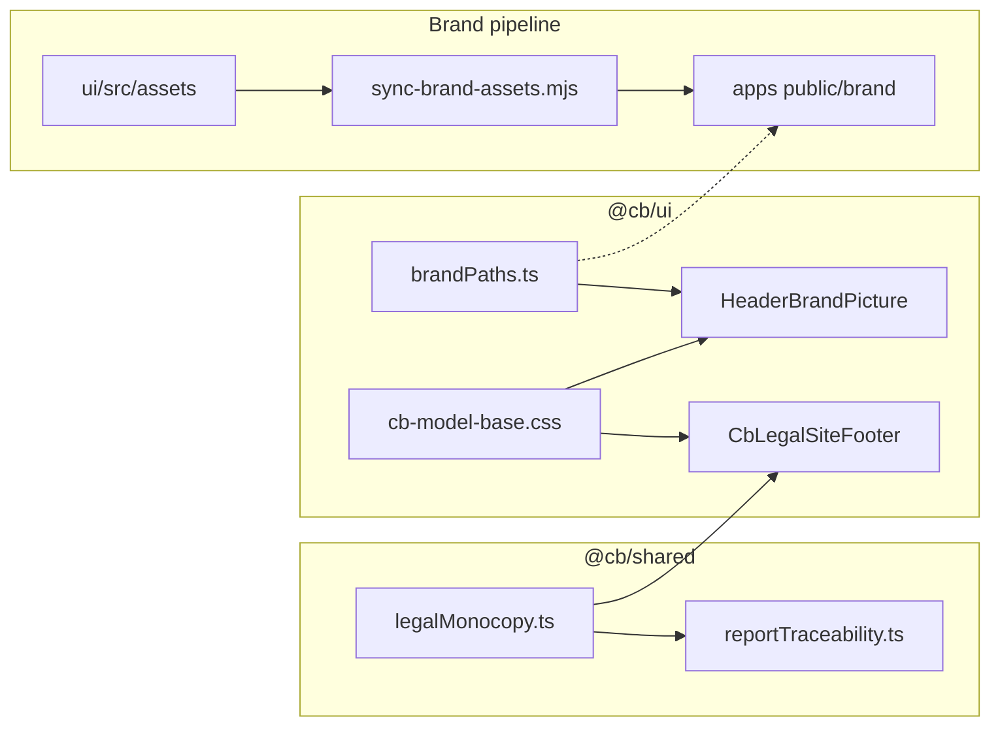

# Cursor handover

**Generated:** 2026-03-28  
**Updated:** 2026-04-22 (Forever Playwright PDF stack, print layout spec, handover continuation block)  
**Purpose:** Start a new chat from this file to avoid long, laggy threads. Paste or @-mention this file when opening a new session.

---

## Snapshot: where `main` should be (this session)

Recent **`origin/main`** includes **Forever strategic report PDF (DOM + Playwright)** work (newest first):

| Commit | Summary |
|--------|---------|
| `2662132` | **fix(pdf):** align advisory print layout — **12mm** fixed header band, **18mm** top margin unchanged; **13mm** horizontal symmetry (`.cb-page` print horizontal padding 0, header/footer/footerTemplate); last-page **green slab** mitigations (hide site `CbLegalSiteFooter` in print, `min-height: 0` on PDF root, `flex: none` + white bg on main when report present). |
| `8270af4` | **fix(pdf):** explicit **18mm** header reservation + **12mm** footer; last-page green bar work (appendix stage label, borders). |
| `5a13f19` | **fix(pdf):** compact print header; last-page green bars. |
| `6dca3e6` | **feat(reports):** shared Playwright PDF template + Forever report polish (`AdvisoryReportPdfDocumentRoot`, `advisoryReportPdfTemplate.css`, wired IE / Health / Stress layouts). |

Earlier chain (still in history): `3535726`, `809aeba`, `5b1e413`, `247ab93` — Forever v6 report modules, charts, cover, logos from `apps/forever/public/brand`.

Older **brand and shell** commits (reference):

| Commit | Summary |
|--------|---------|
| `4823edc` … `0e99bca` | Header `HeaderBrandPicture`, legal footer, login/platform chrome — see **Brand chrome** section below. |
| `69b2529`, `9d248c2` | Capital Stress: Monte Carlo path count copy; EXPAND ALL above Structural Stability Map. |

**Verify current tip:**

```bash
git fetch origin && git log -1 --oneline origin/main
```

**Local working tree:** confirm with `git status`. There may still be **uncommitted** edits (e.g. `apps/login/tailwind.config.ts`, `packages/ui`) and **untracked** assets under `packages/ui/src/assets/` — do not assume a clean tree.

---

## Locked restore point (older — optional)

| | |
|---|---|
| **Tag** | `restore-point-2026-03-28` |
| **Commit** | `eee0b61` — *fix(ui): center ChromeSpinnerGlyph and restore reliable rotation* |

Return with `git checkout restore-point-2026-03-28` or `git checkout eee0b61` if you need the **pre-stress-copy** spinner/layout baseline. For latest product work, use **`origin/main`** instead.

---

## Context and background

### Monorepo

- **Workspace:** `capitalbridge-suite` — apps: `capitalstress`, `capitalhealth`, `incomeengineering`, `forever`, `login`, `platform`, `api`.
- **Shared packages:** `@cb/ui`, `@cb/shared`, `@cb/advisory-graph`, `@cb/lion-verdict`, `@cb/pdf`.
- **Login / pricing (public):** [login.thecapitalbridge.com/pricing](https://login.thecapitalbridge.com/pricing) — SELECT PLANS, auth chrome.
- **Capital Stress (prod example):** `capitalstress.thecapitalbridge.com` — dashboard after login.

### Prior arc (before this conversation’s UI tweaks)

- Pending-button UX: spinner-only-in-control, `ChromeSpinnerGlyph` CSS rotation, `.cb-pending-btn-inner`, header grid fixes.
- Lion trial vs paid: `packages/lion-verdict/access.ts` → `LionVerdictLocked` vs `LionVerdictActive`.
- Optional follow-up: real pricing link on locked Lion control.

---

## What we did in this conversation (completed)

### 1. Capital Stress — CAPITAL DIAGNOSIS + path count

- **File:** `apps/capitalstress/legacy/App.tsx` (inside `{mcResult && …}`).
- **Behaviour:** After **Run Simulation**, the intro paragraph appends **gold, bold, serif, uppercase, tracking-wide** text: **“Based on {n} DATA POINTS ANALYSED”**.
- **Metric:** `{n}` = **`mcResult.simulationCount`** — **number of Monte Carlo paths** from `runMonteCarlo` (via `getSimulationCount(years)`), **not** total daily steps. Example: 10 years → `3,650` paths; formatted with **`toLocaleString()`**.
- **Product wording:** User asked for “DATA POINTS ANALYSED” while confirming the **number** is path count.

### 2. Capital Stress — EXPAND ALL above Structural Stability Map

- **Placement:** Immediately **below** the gold `border-t` divider, **above** the Structural Stability Map card; **right-aligned** ghost gold button; `no-print`.
- **Visibility:** Only when `mcResult && depletionBarOutput != null` (same as map).
- **Logic:** **`toggleExpandAllSections`** (`useCallback` + functional `setCollapsedSections`) toggles all collapsible sections (`structuralStabilityMap`, `capitalOutcomeDist`, `capitalStressRadar`, `furtherStressTest`, `capitalAdjustmentSimulator`). Lower **EXPAND ALL** under Further Structural Stress Test uses the **same** handler.

### 3. Report format strategy (decision — not fully migrated)

- **Agreed standard:** **DOM print route + Playwright** for PDFs across all four model apps (replace divergent **jsPDF** / **@react-pdf/renderer** as the canonical pipeline over time).
- **Existing infra to use:**
  - `scripts/generate-pdf.ts` → `@cb/pdf/render` **`renderPdf({ url, outputPath })`**.
  - Playwright: **`page.goto(realUrl)`**, **`emulateMedia({ media: "print" })`**, wait **`window.__REPORT_READY__ === true`** (default), **`printBackground`**, **`preferCSSPageSize`** — see `packages/pdf/src/renderPdf.ts`.
  - Client helpers: `packages/pdf/src/reportReady.ts` — `beginReportReadyCycle`, `completeReportReadyCycle`, optional `subscribeReportReadyOnPrint`.
- **Shared tokens:** `packages/shared/src/cbReportTemplate.ts` (margins, brand paths, firm lines); `packages/advisory-graph/src/reports/tokens.ts` (print typography/colours). *Update the comment in `cbReportTemplate.ts` when react-pdf is no longer primary.*
- **Per app:** dedicated **print-only route** + `@media print` / shared `print.css`; Capital Stress already has patterns: `PrintReport.tsx`, `@cb/advisory-graph/reports/print.css`, `apps/capitalstress/app/docs/sample-report/page.tsx`.

### 4. Forever strategic report PDF — **implemented on `main` (Apr 2026)**

- **Route:** `apps/forever/app/dashboard/report-document/[exportId]/` — server page + `ForeverReportDocumentClient.tsx` (Lion verdict, trial vs paid, calculator snapshot, appendix CTA to Income Engineering).
- **Export pipeline:** `report_exports` row + lion config; PDF generation uses **`renderPdf`** with **`playwrightFooterFromDom`** (or explicit footer ctx) — `packages/pdf/src/renderPdf.ts`, `packages/pdf/src/playwrightPdfFooter.ts`.
- **Document shell:** `AdvisoryReportPdfDocumentRoot` (`packages/advisory-graph/src/reports/AdvisoryReportPdfDocumentRoot.tsx`) — `data-cb-advisory-report-document`, `ReportPrintChrome`, DOM attrs `CB_PDF_FOOTER_DOM_*` for Chromium footer (`@cb/shared/reportPdfPlaywright`).
- **Shared CSS:** import order in model apps — `reports/print.css` → `reports/pdf-template.css` (maps to **`advisoryReportPdfTemplate.css`**). Named page **`advisory-pdf-doc`**, `@page` margins, fixed `.cb-report-print-header`, appendix/closing print rules (no green stage rule on appendix).
- **Layout spec (as shipped in `2662132`):**
  - **18mm** Playwright top margin + **`@page` top 18mm** — first body column starts at **18mm** from sheet top.
  - **12mm** fixed in-document header band (`--cb-advisory-print-header-height`); constant **`PLAYWRIGHT_PDF_FIXED_PRINT_HEADER_BAND_MM`** documents sync with CSS.
  - **12mm** Chromium footer band (`PLAYWRIGHT_PDF_FOOTER_RESERVED_MM`); **`html.cb-report-pdf-playwright-footer`** hides in-page `ReportPrintChrome` footer.
  - **13mm** left/right: `@page`, Playwright `margin`, fixed print header horizontal padding, footer template horizontal padding; interior **`.cb-page` print horizontal padding 0** so margins are not doubled/asymmetric.
- **Last-page green rectangle:** Mitigated by stripping appendix stage label styling that drew a full-width rule, print border resets on CTA, and **print-only** hide of **`CbLegalSiteFooter`** when the PDF doc is present (dark `#0d3a1d` bar was leaking into the paginated stack); plus **`min-height: 0`** on `.cb-advisory-pdf-doc.cb-report-root` and **`flex: none` + white background** on `.cb-advisory-model-main:has([data-cb-advisory-report-document])`.
- **Charts / modules:** `ForeverReportCharts.tsx`, `ForeverReportModuleSections.tsx` — `ProgressBarTile` uses `#1B4D3E` fill (only on opening snapshot, not appendix).
- **Still not done (broader PDF migration):** Income Engineering jsPDF, Health react-pdf primary, Capital Stress download→Playwright — see **Action items**.

---

## Brand chrome, legal monocopy, and shared header (2026-03-31 — 2026-04-01)

Cross-cutting work to align **login**, **platform**, and **model app** shells: credible financial brand (consistent footer copy, premium hairline rule, readable header lockup).

### Relationships (mental model)



### Header logo (`HeaderBrandPicture`)

- **Component:** `packages/ui/src/HeaderBrandPicture.tsx` (exported from `packages/ui/src/index.ts`).
- **Why `<picture>`:** Replaces a stack of three `` tags with `display` toggles (fragile with flex + container queries; risk of zero-width slot → no visible logo). The browser picks **one** `srcSet` via `media`; the `` `src` is always the lion fallback.
- **Breakpoint ladder** (viewport `min-width`):
  - **≥ 1440px:** `BiggerFont-Capital Logo Vertical Transparent.svg` (tallest wordmark variant).
  - **≥ 1024px:** `Large-Full_CapitalBridge_Gold.svg`.
  - **≥ 400px:** `CapitalBridgeLogo_Gold.svg`.
  - **Under 400px:** `lionhead_Gold.svg` (via default ``).
- **URL constants:** `packages/ui/src/brandPaths.ts` (paths under `/brand/...`).
- **Asset sync:** Add new filenames to `scripts/sync-brand-assets.mjs` so every app’s `public/brand/` stays in sync with `packages/ui/src/assets/`.
- **Sizing CSS:** `packages/ui/src/cb-model-base.css` — `--cb-header-logo-h` (larger mobile/desktop caps), `.cb-header-chrome-picture`, `.cb-header-chrome-picture-img`, `.cb-header-chrome-home` (**`min-width: min-content`**, **`flex-shrink: 0`**). Title size is **decoupled** in `.cb-header-chrome-title` (`clamp` on `font-size`, not tied to logo height).
- **Consumers (replace inline triple logos):**
  - `apps/login/components/Header.tsx` — logo link uses `HeaderBrandPicture`; prefer **`min-w-min`** / **`shrink-0`** on the home anchor (avoid `min-w-0` collapsing the logo slot).
  - `apps/platform/app/components/PlatformMarketingHomeLink.tsx`, `PlatformFrameworkHeader.tsx` — same pattern; inline `minWidth: 'min-content'`.
  - `packages/ui/src/ModelAppHeader.tsx` — spine and legacy rows use `HeaderBrandPicture` inside `ChromePendingNavLink` where applicable.
- **Model header spacing:** `packages/ui/src/ModelAppHeader.module.css` — increased gap / margin between logo and page title (`.spineDesktopLeft`, `.logoLink`); spacer heights aligned to chrome content height.

### Legal footer (`CbLegalSiteFooter`)

- **Copy source of truth:** `packages/shared/src/legalMonocopy.ts` → `CAPITAL_BRIDGE_SITE_LEGAL_MONOCOPY`.
- **Component:** `packages/ui/src/CbLegalSiteFooter.tsx` — dark green bar, generous horizontal padding (`px-6` … `lg:px-24`), no heavy `border-t`; top ornament is **`.cb-legal-footer-top-rule`** (1px gold **gradient** fading to transparent at edges).
- **Typography:** **`.cb-legal-footer-copy`** in `cb-model-base.css` (centered, `max-width`, small `clamp` font size, `text-wrap: pretty`, line-height tuned so **desktop reads as ~two lines** for trust/consistency).
- **Reports / PDFs:** `packages/shared/src/reportTraceability.ts` — `CB_REPORT_LEGAL_NOTICE` re-exports the same string as the site monocopy (no drift). **Forever** `apps/forever/legacy/foreverPdfBuild.ts` appends this notice in generated PDFs.
- **Footer visibility bug (fixed):** `apps/login/app/globals.css` had **`color: ... !important`** on `html, body`, which overrode footer text color (cream on green). Use **`color: var(--cb-cream)`** without `!important` so footer classes apply.

### Pricing / marketing typography (login app)

- **Roboto Serif for section titles:** e.g. `apps/login/app/pricing/PricingContent.tsx` — hero tagline and trust-layer feature titles use Tailwind **`font-serif`**.
- **Tailwind mapping fix:** `apps/login/tailwind.config.ts` — `font-serif` → **`var(--cb-font-serif)`**, `font-sans` → **`var(--cb-font-sans)`** (matches tokens in `cb-model-base.css`; the old `--font-roboto-serif` reference was undefined, so serif fell back to Inter).

### Debugging notes worth preserving

- **Logo “missing”:** Often **`flex-shrink`** + **`min-width: 0`** on the logo wrapper → zero width → **`max-width` in `vw`** or image collapses. Fix: **`shrink-0`**, **`min-width: min-content`** on the home link, single `<picture>` asset ladder.
- **`cqw`:** Avoid tying logo `max-width` to container query width when the container can be width 0 during layout; **`vw`** / fixed caps are safer for the chrome picture img.

---

## Action items for the next session (suggested)

1. **PDF migration (large):**  
   - **Forever:** **dashboard export PDF** uses DOM + Playwright + shared advisory template (`report-document/[exportId]`). **Legacy** `apps/forever/legacy/foreverPdfBuild.ts` (jsPDF) may still exist for older flows — confirm product source of truth.  
   - **Income Engineering:** move off `jsPDF` in `App.tsx` / `PrintReportView` toward a print URL + Playwright.  
   - **Capital Health:** add DOM print route mirroring `CapitalGrowthReport` sections; deprecate or secondary **@react-pdf/renderer** for “official” PDF.  
   - **Capital Stress:** ensure **download** path can target print URL + Playwright where server/CI PDF is needed; keep `window.print()` if product wants browser print too.

2. **Shared report shell:** Extract repeated DOM (cover, section headers, legal block) into `@cb/ui` or `@cb/advisory-graph` so all four print routes stay aligned.

3. **Optional copy tweak:** If “DATA POINTS ANALYSED” should say **paths** for accuracy, rename while keeping `simulationCount`.

4. **Handover hygiene:** After large milestones, bump **Snapshot** table at top of this file + `git log -1`.

5. **Brand assets:** When adding or renaming SVGs in `packages/ui/src/assets/`, update **`scripts/sync-brand-assets.mjs`** and run sync (or CI equivalent) so `public/brand/` in each app matches.

6. **Footer / header regressions:** If legal text vanishes, check **global `color` + `!important`** on `body`. If the header logo disappears, check **flex min-width / shrink** and that **`HeaderBrandPicture`** breakpoints still match available files under `/brand/`.

---

## Useful paths (quick reference)

| Area | Path |
|------|------|
| Capital Stress dashboard UI | `apps/capitalstress/legacy/App.tsx` |
| Capital Stress print layout | `apps/capitalstress/legacy/PrintReport.tsx` |
| Monte Carlo / `simulationCount` | `apps/capitalstress/legacy/services/mathUtils.ts` (`getSimulationCount`, `runMonteCarlo`) |
| Playwright PDF | `packages/pdf/src/renderPdf.ts`, `packages/pdf/src/playwrightPdfFooter.ts`, `scripts/generate-pdf.ts` |
| Forever dashboard report PDF (DOM) | `apps/forever/app/dashboard/report-document/[exportId]/` (`page.tsx`, `ForeverReportDocumentClient.tsx`, `ForeverReportCharts.tsx`, `ForeverReportModuleSections.tsx`) |
| Shared advisory PDF print CSS | `packages/advisory-graph/src/reports/advisoryReportPdfTemplate.css` (import as `@cb/advisory-graph/reports/pdf-template.css`), `reportsPrint.css` |
| Report PDF DOM / Playwright tokens | `packages/shared/src/reportPdfPlaywright.ts`, `packages/shared/src/reportTraceability.ts` |
| Report ready flag | `packages/pdf/src/reportReady.ts` |
| Model footer / download CTA | `packages/ui/src/ModelReportDownloadFooter.tsx` |
| Shared print CSS tokens (apps) | `packages/ui/src/cb-model-base.css`, `packages/advisory-graph/src/reports/` |
| **Global design tokens + header/footer chrome** | **`packages/ui/src/cb-model-base.css`** |
| **Responsive header logo** | **`packages/ui/src/HeaderBrandPicture.tsx`**, **`packages/ui/src/brandPaths.ts`** |
| **Legal site footer** | **`packages/ui/src/CbLegalSiteFooter.tsx`** |
| **Legal monocopy string** | **`packages/shared/src/legalMonocopy.ts`**, **`packages/shared/src/reportTraceability.ts`** |
| **Copy brand assets to apps** | **`scripts/sync-brand-assets.mjs`** |
| Login marketing header | `apps/login/components/Header.tsx` |
| Login global CSS (body color / imports) | `apps/login/app/globals.css` |
| Login pricing sections | `apps/login/app/pricing/PricingContent.tsx` |
| Login Tailwind fonts | `apps/login/tailwind.config.ts` |
| Platform chrome | `apps/platform/app/components/PlatformMarketingHomeLink.tsx`, `PlatformFrameworkHeader.tsx` |
| Model app header chrome | `packages/ui/src/ModelAppHeader.tsx`, `ModelAppHeader.module.css` |
| IE print | `apps/incomeengineering/legacy/components/PrintReportView.tsx` |
| Health PDF (react-pdf today) | `apps/capitalhealth/legacy/CapitalGrowthReport.tsx` |
| Forever PDF legacy (jsPDF) | `apps/forever/legacy/foreverPdfBuild.ts` |
| Lion | `packages/lion-verdict/` |

Other notes in repo: `gpthandover.md`, `Cursor-handover.txt`, `lapsap.txt` (if present).

---

## Your role (next assistant)

- Read this file first; use **Snapshot**, **Brand chrome** (if touching headers/footers), and **Action items** to pick up work.
- **Be concise**; confirm scope before megarefactors (especially PDF migration).
- Prefer **focused diffs**; match existing patterns in each app until shared shell exists.
- For **trust-sensitive UI** (legal copy, header lockup), prefer **`@cb/shared`** + **`@cb/ui`** single sources (`legalMonocopy`, `HeaderBrandPicture`, `cb-model-base.css`) over one-off strings or duplicate `` stacks.
## --- CONTEXT CONTINUATION (Gitex Pre-Launch Phase) ---

### Current State (as of latest session)

Capital Bridge platform is in final pre-launch phase for Gitex (Singapore).

Core systems are already implemented and stable:

1. PRODUCT LAYERS COMPLETE
- 4-model framework:
  1. Evaluate Sustainability (Forever Income)
  2. Engineer Capital (Income Engineering)
  3. Stress Test Resilience (Capital Health / Stress)
  4. Execute Strategy (Strategic Execution)

- Lion’s Verdict:
  - Fully dynamic, personalised, non-generic
  - Integrated across all apps and PDF

- PDF System:
  - Premium, multi-page, dual-layer (At-a-Glance + Detailed)
  - No formulas exposed
  - Strong branding + legal protection
  - Strategic execution section included
  - Authority signals (report ID, date, framework note)

---

2. STRATEGIC EXECUTION (CRITICAL LAYER)

Fully implemented:

- /solutions page (platform.thecapitalbridge.com)
- Plan gating:
  - Only Strategic users can submit
  - Trial / non-strategic:
    - CTA disabled
    - Tooltip shown
    - No modal access

- UX:
  - Clear execution positioning
  - “This is where capital starts working for you”
  - Strategic advantages reframed as outcomes
  - Progression nudge added

- Submission flow:
  - Stored in Supabase: public.strategic_interest
  - Optional contact_phone field included
  - Admin email notification via Resend
  - No partner routing yet (pre-partner phase)

---

3. PIPELINE STATUS

System now functions as:

User → Models → Lion Verdict → Strategic Execution → Submit → DB + Email

This is now:
- A demand capture system
- A pre-partner pipeline
- A conversion boundary between analysis and execution

---

4. UX / UI STATUS

- Framework updated to 4-step flow (includes Execute Strategy)
- Strategic tile visible across:
  - Framework landing
  - Dashboard (V2)

- Header/footer/branding unified
- Responsive logo system implemented
- Legal footer + typography standardised

- Final UI polish applied:
  - Tooltip refinement
  - Modal copy refinement
  - Progression nudge softened
  - Disabled CTA behaviour correct

---

5. WHAT WAS INTENTIONALLY NOT DONE

- No partner integration yet (Malaysia / Singapore onboarding ongoing)
- No auto-routing to banks/insurers
- No aggressive conversion layer (kept premium and controlled)

---

6. NEXT PHASE (DO NOT REPEAT PREVIOUS WORK)

We are now moving into:

### AI LAYER (FINAL STAGE BEFORE GITEX)

Two separate systems to implement:

1. El-Capitan GPT
- External voice (QR via plushies, marketing)
- Purpose:
  - Challenge user thinking
  - Reframe financial behaviour
  - Introduce “forever income” concept
- Tone:
  - Sharp, intelligent, slightly confrontational
  - Never generic

2. Website Chatbot
- Internal assistant
- Purpose:
  - Guide users through platform
  - Explain models and outputs
  - Assist with onboarding and plans
- Tone:
  - Calm, structured, helpful
  - Step-by-step guidance

---

7. CURRENT PRIORITY

Next step in new chat:

- Run El-Capitan scenario simulations:
  - Layman (no knowledge)
  - Overconfident investor
  - Skeptical finance professional
  - Reckless spender

- Refine tone and response behaviour

- Then generate:
  - El-Capitan JSON
  - Chatbot JSON

---

8. OPERATING RULES (IMPORTANT)

- Do NOT revisit completed implementation steps
- Do NOT suggest structural rebuilds
- Focus only on:
  - refinement
  - AI behaviour
  - conversion quality
  - real-world usage (Gitex context)

- Keep responses:
  - concise
  - actionable
  - no fluff

---

## Handoff: paste into a new chat (context continuation)

Copy everything inside the block below into your next Cursor message (or `@Cursor_Handover.md` and point to this section).

```
This GPT chat is now too long and laggy. You will be continuing this entire conversation in a new chat. Please read @Cursor_Handover.md (especially Snapshot, §4 Forever strategic report PDF, Action items, and the Gitex section if relevant).

PASTE CONTEXT AND SUMMARY:

- Repo: capitalbridge-suite. Branch: main. Latest pushed PDF work: commit 2662132 (and chain 8270af4 → 6dca3e6) — Forever strategic report uses DOM print + Playwright; shared advisoryReportPdfTemplate.css + AdvisoryReportPdfDocumentRoot; 12mm fixed print header band, 18mm top margin, 13mm horizontal symmetry, 12mm footer; mitigations for last-page green slab (hide CbLegalSiteFooter in print, min-height/flex on report main).
- User had annotated PDFs: header rhythm, equal L/R margins body+footer, remove green block on last page — addressed in 2662132 unless QA finds regressions.
- Forever report code: apps/forever/app/dashboard/report-document/[exportId]/; lion config / report_exports API paths in repo as of that branch; see Handover paths table.
- Other threads in same file: Gitex pre-launch, El-Capitan / website chatbot AI layer — do not redo completed product work; next steps there are scenario simulations and JSON artifacts unless user redirects.
- Local tree may still have uncommitted UI/assets; always git status before assuming clean.

Your role:
- Pick up exactly where the previous discussion left off.
- Assume the summary above is accurate; if unclear, ask targeted questions instead of guessing.
- Be concise and action-oriented; no reply required until the user gives further instructions.
```

---

## END OF CONTEXT